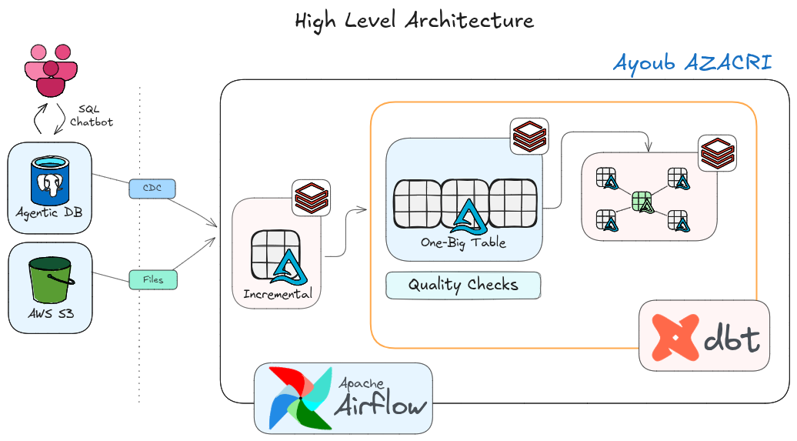

# 🛒 Walmart End-to-End Lakehouse & Data Engineering Pipeline

Welcome to the **Walmart End-to-End Lakehouse & Data Engineering Project** repository! 🚀

This project demonstrates an enterprise-grade, production-ready **Lakehouse Data Engineering Solution** simulating real-time Walmart e-commerce and retail transactions. It integrates **Ghost PostgreSQL (OLTP)**, **Databricks Unity Catalog (Delta Lake)**, **dbt Core**, and **Apache Airflow (Docker)** to implement a complete **Medallion Architecture** with Change Data Capture (CDC), Metadata-Driven Pipelines, Slowly Changing Dimensions (SCD Type 2), and automated CI/CD-style quality testing.

---

## 🏗️ Lakehouse Architecture

The end-to-end data pipeline follows the **Medallion Lakehouse Architecture** across **Bronze**, **Silver**, and **Gold** layers:

<p align="center">
  
</p>

```
┌──────────────────────────────┐

│  1. GHOST POSTGRES (OLTP)    │  ◄── Live transactional DB (customers, orders, products, stores)
└──────────────┬───────────────┘
               │  (Incremental PySpark CDC Ingestion via JDBC)
               ▼
┌──────────────────────────────┐
│  2. DATABRICKS BRONZE        │  ◄── Raw Delta Lake Tables (`walmart.bronze.*`)
└──────────────┬───────────────┘
               │  (dbt Transformations & Data Quality Tests)
               ▼
┌──────────────────────────────┐
│  3. DATABRICKS SILVER        │  ◄── `silver_t`: Cleaned & Deduplicated Tables
│                              │  ◄── `silver_b`: Metadata-Driven One Big Table (OBT)
└──────────────┬───────────────┘
               │  (Star Schema Decomposition & SCD Type 2 Snapshots)
               ▼
┌──────────────────────────────┐
│  4. DATABRICKS GOLD          │  ◄── `snapshots`: SCD Type 2 Historical Dimensions
│                              │  ◄── `fact_orders`: Line-Item Grain Analytical Facts
└──────────────┬───────────────┘
               ▲
               │ (Orchestrated on schedule via Docker)
┌──────────────┴───────────────┐
│  5. APACHE AIRFLOW (DAG)     │  ◄── Databricks SDK Polling + 9-Stage Circuit Breaker
└──────────────────────────────┘
```

---

## 🚀 Key Project Highlights & Engineering Design

### 1. Ingestion Layer (CDC & Databricks Ingestion)
* **Change Data Capture (CDC)**: Incremental watermarking using `updated_timestamp` over JDBC pushdown queries to ingest only new and modified records into Delta Lake, eliminating costly full-table reloads.
* **ACID Transactions**: Stored as **Delta Lake** tables inside Databricks Unity Catalog for ACID compliance, time-travel, and efficient upserts.

### 2. Transformation Layer (dbt Medallion Architecture)
* **Silver Technical (`silver_t`)**: Cleanses raw tables, enforces datatype standardization, and applies generic tests (`unique`, `not_null`, `severity` thresholds).
* **Metadata-Driven OBT (`silver_b.obt_b`)**: Built using dynamic Jinja loops and metadata configuration dictionaries to generate multi-table One Big Table joins without repetitive boilerplate SQL.
* **Ephemeral Dimension Extraction (`models/gold/ephemeral/`)**: Decomposes the OBT into 5 ephemeral models (`eph_customers`, `eph_stores`, etc.) that compile as CTEs directly in memory with zero storage overhead.
* **SCD Type 2 Dimension Snapshots (`snapshots/`)**: Tracks historical customer and product changes (e.g. address or price changes) over time using dbt YAML snapshots (`dbt_valid_from`, `dbt_valid_to`).
* **Gold Fact Table (`models/fact/fact_orders`)**: Star Schema fact modeling joining dimensions on composite keys (`order_id + order_item_id`) to prevent join fan-out and grain mismatch errors.

### 3. Orchestration Layer (Apache Airflow in Docker)
* **Containerized Deployment**: Airflow 3.x webserver, scheduler, triggerer, and PostgreSQL metadata database deployed via Docker Compose with mounted dbt project volumes.
* **Databricks SDK Integration**: Python TaskFlow task triggering Databricks remote jobs and executing a synchronous polling loop with typed Enums (`RunLifeCycleState.TERMINATED` & `RunResultState.SUCCESS`).
* **Fail-Fast Circuit Breaking**: Granular task execution (`silver_technical >> silver_technical_tests >> silver_business >> gold_dimensions >> gold_facts`) that immediately halts the pipeline if data quality checks fail.

---

## 🛠️ Tech Stack

| Domain | Technology / Tool | Purpose in Project |
| :--- | :--- | :--- |
| **OLTP Source DB** | **Ghost PostgreSQL** | Ephemeral, agentic cloud database simulating Walmart transactional sales. |
| **Compute & Lakehouse**| **Databricks Unity Catalog** | Distributed Spark engine, Delta Lake ACID tables, and SQL Warehouses. |
| **Transformation** | **dbt Core (dbt-databricks)** | SQL modeling, Jinja macros, generic testing, and SCD Type 2 snapshots. |
| **Orchestration** | **Apache Airflow 3 (Docker)** | Task scheduling, Databricks API triggering, and pipeline monitoring. |
| **Object Storage** | **AWS S3** | Cloud landing zone for raw external file feeds and checkpoint storage. |
| **Package Management**| **`uv` (Astral)** | High-speed Rust-based Python virtual environment and dependency manager. |

---

## 📊 Complete Airflow Orchestration Workflow

```
[ Ingest CDC (Databricks SDK) ]
              │
              ▼
[ Clean Target (rm -rf target/) ]
              │
              ▼
[ Source Freshness (dbt) ]
              │
              ▼
[ Silver Technical (dbt run --select silver_t) ]
              │
              ▼
[ Silver Technical Tests (dbt test --select silver_t) ] ◄── CIRCUIT BREAKER
              │
              ▼
[ Silver Business OBT (dbt run --select silver_b) ]
              │
              ▼
[ Silver Business Tests (dbt test --select silver_b) ]  ◄── CIRCUIT BREAKER
              │
              ▼
[ Gold Ephemeral Views (dbt run --select gold/ephemeral) ]
              │
              ▼
[ Gold Dimensions (dbt snapshot) ]
              │
              ▼
[ Gold Facts (dbt run --select fact_orders) ]
```

---

## 🚀 Quickstart & Setup Guide

### 1. Clone & Setup Python Environment
```bash
git clone https://github.com/ayoubazacri/Walmart_Airflow_DBT_Project.git
cd Walmart_Airflow_DBT_Project

# Create environment and install dependencies with uv
uv sync
source .venv/bin/activate
```

### 2. Setup Source Database (Ghost PostgreSQL OLTP)
This project uses **Ghost** as the live agentic OLTP PostgreSQL database.

1. **Create Database**: Provision a PostgreSQL instance on [Ghost](https://ghost.org/) (or use any cloud Postgres instance).
2. **Execute DDL Schema**: Run [`walmart_dataset/ddl/walmart_schema.sql`](walmart_dataset/ddl/walmart_schema.sql) in your database query editor to generate the `raw` schema and tables (`customers`, `stores`, `products`, `employees`, `orders`, `order_items`).
3. **Seed Transaction Data**: Open [`walmart_dataset/load_data.py`](walmart_dataset/load_data.py), add your Ghost connection string:
   ```python
   conn_string = "postgresql://<user>:<password>@<host>:<port>/<dbname>?sslmode=require"
   ```
   Then run the seed script:
   ```bash
   python walmart_dataset/load_data.py
   ```

### 3. Configure dbt Connection (`profiles.yml`)
Ensure `walmart_project/profiles.yml` is configured with your Databricks SQL Warehouse:
```yaml
walmart_project:
  target: dev
  outputs:
    dev:
      type: databricks
      catalog: walmart
      schema: dbt_schema
      host: <your-databricks-host>
      http_path: /sql/1.0/warehouses/<warehouse-id>
      token: <your-databricks-token>
      threads: 4
```

Verify connection:
```bash
cd walmart_project
dbt debug
```

### 4. Start Apache Airflow with Docker
Generate your local `.env` from the provided `.env.example` or with your current user ID:
```bash
cd airflow_dbt_project
echo -e "AIRFLOW_UID=$(id -u)\nAIRFLOW_GID=0" > .env
docker compose up -d
```

Open Airflow UI at **`http://localhost:8080`** (User: `airflow` / Password: `airflow`) and trigger the **`orchestrate`** DAG!

---

## 🛡️ License

This project is licensed under the [MIT License](LICENSE). You are free to use, modify, and share this project with proper attribution.

---

## 🌟 About Me

Hi there! I'm **AZACRI Ayoub** — Data Engineer passionate about building scalable Cloud Lakehouses, distributed data pipelines, and automated data platforms.

* 💼 **LinkedIn**: [Ayoub AZACRI](https://www.linkedin.com/in/ayoub-azacri/)
* 🐙 **GitHub**: [Ayoub-Azacri](https://github.com/Ayoub-Azacri)

